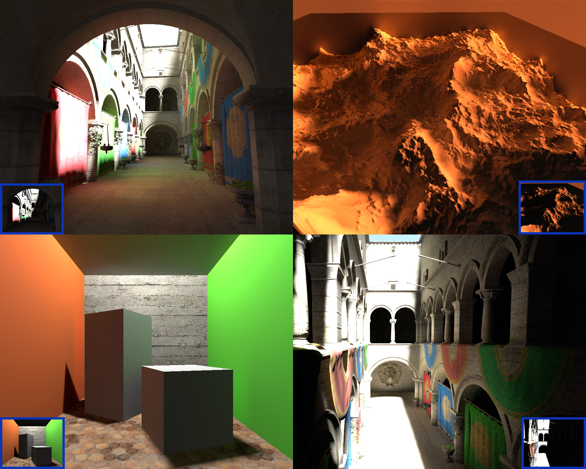

# HBIL Demo

This is the HBIL technique demo project that offers a cheap but efficient way to add ambient occlusion and indirect lighting by exploiting the maximum of the existing screen-space information.

The technique is an exact complement to the far-field indirect lighting offered by environment probes and, together, they should bring a lot of realism to your renderings.

You can read the details about the mathematical theory in the accompanying PDF paper: [2018 Mayaux - Horizon-Based Indirect Lighting (HBIL).pdf](2018%20Mayaux%20-%20Horizon-Based%20Indirect%20Lighting%20(HBIL).pdf).

# Performance

When DirectX Debug layer is disabled, the technique runs at ~2.5ms @ 1280x720 on my GeForce 680GTX in the Crytek Sponza Atrium and pretty much any other scene (it's a screen-space technique).

There's also plenty of room for optimization, especially in the inner loop where I uselessly recompute the reprojection of normals and other direction vectors whereas it should be stored somewhere...

# Issues

* Lots of noise! but I'm really not an expert with TAA so I'm only relying on a temporal reprojection routine I grabbed somewhere and that I don't really master. I think there's a lot of room for improvement on that end...
* AO is lacking precision due to large step sizes (i.e. we often cover the entire screen, gathering irradiance) whereas most AO details often stand close to the center point.
 Unfortunately, if we reduce step sizes then indirect lighting gets much poorer. We definitely need *more samples* here, but that's the core parameter driving the speed of the technique.

# Build

You pretty much need the entire [GodComplex](../../) repository because the project relies on various image, rendering, math and tool libraries present in my framework.

Open the [Tests.sln](../../Tests.sln) solution file, ideally with Visual Studio 2012, choose "Debug/Release" configuration and the "x64" platform and build.
