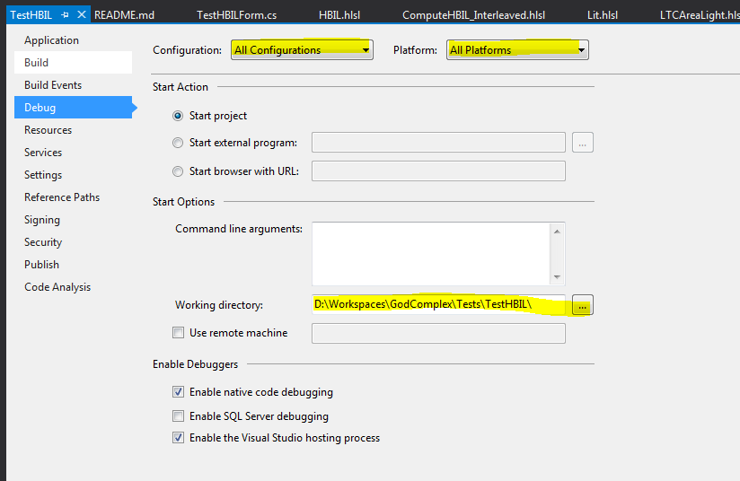

# HBIL Demo

This is the HBIL technique demo project that offers a cheap but efficient way to add ambient occlusion and indirect lighting by exploiting the screen-space information at its maximum potential.

This near-field technique is an exact complement to the far-field indirect lighting offered by environment probes and, together, they should bring a lot of realism to your renderings.

You can read the details about the mathematical theory in the accompanying PDF paper: [2018 Mayaux - Horizon-Based Indirect Lighting (HBIL).pdf](2018%20Mayaux%20-%20Horizon-Based%20Indirect%20Lighting%20(HBIL).pdf).

# Performance

When DirectX Debug layer is disabled, the technique runs at ~2.5ms @ 1280x720 on my GeForce 680GTX in the Crytek Sponza Atrium and pretty much any other scene (it's a screen-space technique after all).

There's also plenty of room for optimization, especially in the inner loop where I uselessly recompute the reprojection of normals and other direction vectors whereas it should be stored somewhere once and for all...

The reprojection steps can also be bypassed altogether: using the current frame's lighting only will give you a single bounce instead of theoretically an infinity of bounces, or you could attempt to re-use your
 temporal radiance history buffer as a source of radiance values. Although it's not completely correct to re-use a mix of diffuse+specular radiance, it doesn't really hampers the final integration of irradiance.

# Issues

* Lots of noise! but I'm really not an expert with TAA so I'm only relying on a temporal reprojection routine I grabbed somewhere and that I don't really master. I think there's a lot of room for improvement on that end...
* AO is lacking precision due to large step sizes (i.e. we often cover the entire screen, gathering irradiance) whereas most AO details often stand close to the center point.
 Unfortunately, if we reduce step sizes then indirect lighting gets much poorer. We definitely need *more samples* here, but that's the core parameter driving the speed of the technique.
* No off-screen reflection. Obviously, since it's a screen-space technique. But that's where the far-field irradiance solution should intervene and compensate for this issue...
 HBIL alone is not a definitive solution to all indirect lighting problems.

# Build

You pretty much need the entire [GodComplex](../../) repository because the project relies on various image, rendering, math and tool libraries present in the framework.

* Open the [Tests.sln](../../Tests.sln) solution file, preferably with **Visual Studio 2012** (I know I should have updated to something more recent like Visual 2017 but I haven't found the time yet)
* Choose the "Debug/Release" configuration and the "x64" platform
* Edit the project properties for all configurations/platforms and select the project's directory as runtime directory:
  
* Select the scene type in TestHBILForm.cs (e.g. #define SCENE_LIBRARY), by default it's set to the "Library" scene
	Note that some scenes are 3D scenes that need to be downloaded and unpacked from various websites, refer to [this example](./Scenes/Casual-Effects.com/) for more info.
* Build (F5 key)
* Run

# Controls

If you're familiar with the Maya or Unity camera then my camera manipulator works the same
Otherwise:

* No key pushed:

** Left button = Orbit about target
** Middle button = Pan both camera and target
** Right button = Zoom in/out on target

* LShift pushed (first person view):

** Left button = Forward/backward + look left/right
** Middle button = Pan both camera and target
** Right button = Look around

* LAlt pushed (Light control):

** Left button = Rotate light direction (in scenes with ambient only, rotates the SH environment. In scenes with directional light, rotates the directional)
** Middle button = <NOTHING>
** Right button = <NOTHING>

* LControl pushed (Debug):

** Any button = Attempts to read back buffers for debugging purpose. Crashes at the moment since it's been ages since I've used this tool.

Shortcut keys:

* SPACE = Toggles HBIL
* R = Reloads modified shaders
* A = Toggles reprojection matrix copy ON/OFF (used for debugging scene reprojection, otherwise it's quite useless)

